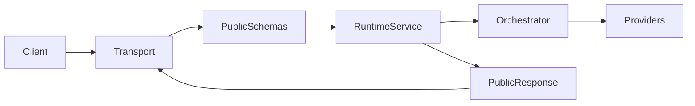

# Runtime API surface (Phase 9)

This document describes the **external HTTP boundary** for ZAYDEN: how clients reach the governed runtime without bypassing contracts, normalization, or orchestration.

## API boundary architecture

Layers are ordered strictly outside-in:

1. **Transport** (`runtime/api/transport/*`, `runtime/api/handlers/*`): Node HTTP server, routing, request context, and response serialization only. Handlers do not embed routing rules, provider selection, or memory assembly.
2. **Public validation + normalization** (`runtime/api/normalization/*`, `runtime/api/schemas/*.json`): External JSON is validated against **public** JSON Schemas (version `1.0.0` under `https://zayden.local/schemas/api/1-0-0/`). Valid payloads map to `NormalizedChatInput` and related internal shapes.
3. **Runtime service** (`runtime/core/runtime-service.ts`): The **only** orchestration entrypoint invoked by transport. It builds internal `ProviderRequest` / routing inputs, calls `RuntimeOrchestrator`, and returns either a schema-checked public response object or a mapped public error body.
4. **Internal contracts** (`runtime/contracts/*`): Unchanged provider/chat/memory schemas used **inside** the runtime after normalization. They are not re-exposed verbatim as the public HTTP contract.

## Public vs internal contracts

| Concern | Public API (`runtime/api/schemas`) | Internal runtime (`runtime/contracts`) |
| --- | --- | --- |
| Audience | External integrators | Runtime modules, adapters, tests |
| Stability | Narrow, stable envelope; additive changes versioned | Governed, already validated at boundaries |
| Content | Session id, modes, policies as **summaries** | Full `ProviderRequest`, tool payloads, memory context |
| Errors | `PublicErrorBody` (no stacks) | `RuntimeErrorEnvelope` and richer routing metadata |

The public layer **maps** between these worlds; it does not alias internal schemas as public ones.

## Endpoint overview

| Method | Path | Role |
| --- | --- | --- |
| `POST` | `/api/chat` | Chat completion via normalized policies and orchestration |
| `GET` | `/api/health` | **Liveness**: process is accepting HTTP |
| `GET` | `/api/readiness` | **Readiness**: minimal runtime prerequisites to serve chat (see below) |

## Request/response lifecycle (`POST /api/chat`)

1. **Request context**: Each request receives a `request_id` (UUID), `start_time_ms`, route, and HTTP method (`runtime/api/transport/request-context.ts`).
2. **Body limits**: Handler caps body size (512 KiB); oversize → `400` `INVALID_REQUEST`.
3. **JSON parse**: Malformed JSON → `400`.
4. **Public schema validation**: `parseAndNormalizeChatRequest` validates then maps to `NormalizedChatInput` (throws `PUBLIC_REQUEST_INVALID` on failure → `400`).
5. **Execution**: `RuntimeService.executeChat` builds internal request + optional memory context, calls `RuntimeOrchestrator.route`, measures latency.
6. **Response**: Success → `buildPublicChatResponse` (Ajv-validated public chat response). Routing/runtime failure → `mapRoutingEnvelopeToPublic` (and `408` when resilience marks a timeout). Unexpected exceptions → `mapUnknownErrorToPublic` (`500`, sanitized message).

## Error mapping model

- **400** `INVALID_REQUEST`: Public schema or normalization failure.
- **404** `NOT_FOUND`: Unknown route (still returns `request_id`).
- **408**: Routing completed with `resilience.timeout_triggered` (mapped from orchestration outcome).
- **409**: Policy violations (`ROUTING_POLICY_VIOLATION`, `INVALID_PROVIDER_FOR_MODE`, `FALLBACK_NOT_ALLOWED`, etc.) per `mapRoutingEnvelopeToPublic`.
- **502** / **503**: Provider execution or availability classes (see `api-errors.ts`).
- **500** `INTERNAL_ERROR`: Unguarded exceptions; messages are stripped of stack-like lines; responses never include raw stack traces.

Every error payload includes **`request_id`**.

## Readiness semantics

`RuntimeService.describeReadiness()` answers whether the process can meaningfully serve `/api/chat`:

- **Not ready (`503`)** when **no provider adapters** are registered on the injected `ProviderRegistry` (cannot satisfy any routing path).
- **Ready (`200`)** when at least one adapter exists. Optional providers or degraded bridges are **not** required for readiness; deeper health belongs to internal harnesses and ops checks.

The HTTP response includes `{ ready, request_id, reason? }`.

## Observability fields (transport scope)

API-layer logs are **transport-focused** and must not duplicate full runtime tracing:

- **Request start** (`zayden.api.request`): `request_id`, `route`, `method`, optional `session_id`, timestamp.
- **Access** (`zayden.api.access`): `request_id`, `route`, `method`, `status_code`, `latency_ms`, `normalized_error_code`, optional `session_id`.

Business-path telemetry (`runtime_mode`, `provider_requested`, `provider_actual`, `fallback_reason`, `tool_calls`, `memory_hits`, etc.) lives in the **public chat response envelope** and internal `RoutingResult` / inspection contracts, documented in `docs/architecture/observability.md`.

## Related documents

- Runbook: `docs/runbooks/api-operations.md`
- ADR: `docs/decisions/ADR-0010-runtime-api-boundary.md`
- Phase record: `docs/phases/phase-09-runtime-api-surface.md`
